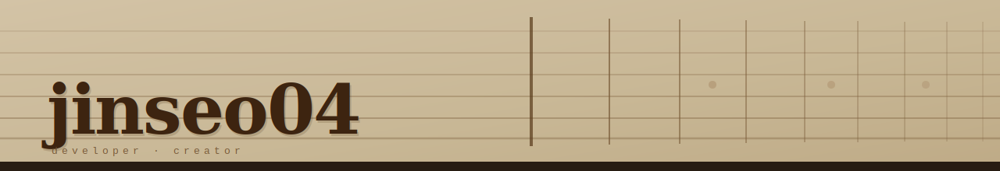
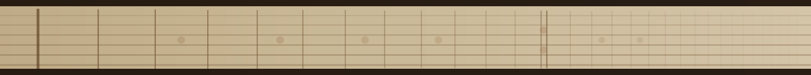

<div align="center">



[](https://git.io/typing-svg)

<br/>


[](https://github.com/jinseo04)

</div>

---

## About Me

```typescript
const jinseo04 = {
  name    : "최진서",
  role    : "Web & Backend Developer",
  location: "Seoul, South Korea",
  studying: ["React", "JSP", "JAVA", "Python" ,"MY SQL"],
  contact : "jinseo5858@naver.com",
};
```

<br/>

---

## 🎓 Education

- **동양미래대학교** 컴퓨터소프트웨어공학과 재학 | 2023.03. ~ 현재

<br/>

---

## 🛠️ Tech Stacks

### 💻 Back-end

-- 파이선 추가해줘


### 🎨 Front-end


### ⚙️ Tools & OS


### 🌱 Currently Learning


- **React** — Hooks, State Management, Component Architecture
- **Database** — ERD 설계, SQL 최적화
- **JSP/Servlet** — 세션 관리, MVC 패턴

<br/>

---

## ✨ Experience
- 솜커톤 대회 **우수상** - 알림 리마인더 및 이벤트 추천 AI

<br/>


---

## Contact

<div align="center">

[](mailto:jinseo5858@naver.com)
[](https://github.com/jinseo04)

</div>

<br/>


